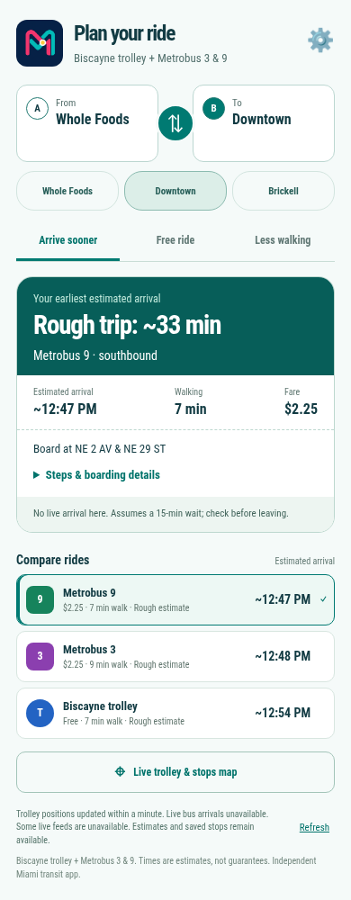
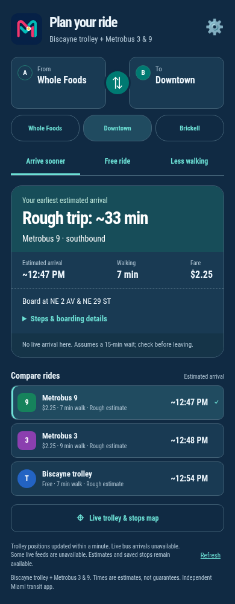
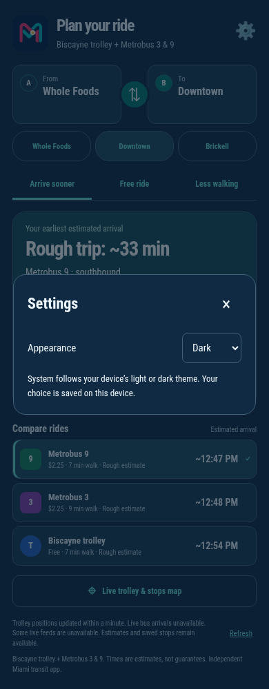

<p align="center"></p>

<h1 align="center">Miami Transit Board</h1>
<p align="center"><strong>Less guessing. More Miami.</strong><br />Know when to leave, where to board, and how to get back.</p>

[](https://github.com/curajorge/miami-transit-board/actions/workflows/ci.yml)
[](LICENSE)

A deterministic, mobile-first decision board for trips from Edgewater toward Downtown Miami and Brickell. It combines the Biscayne trolley with nearby Metrobus 3 and 9 arrivals and answers a practical question: **when should I leave, where should I board, and when should I expect to arrive?**

No AI is used for trip recommendations. Every recommendation comes from explicit timing, walking, direction, and reliability rules in [`engine.js`](engine.js).

**Android preview · Open source · Google Play planned, not yet published**

## A little Miami, day or night

<table>
  <tr><th>Plan your ride</th><th>After hours</th><th>Make it yours</th></tr>
  <tr>
    <td></td>
    <td></td>
    <td></td>
  </tr>
</table>

Actual mobile-web captures, not mockups. Arrival times are a snapshot, not a promise; rough estimates are labeled in the app. [Screenshot notes](docs/screenshots/README.md).

Choose **From** and **To**, compare rides, then expand the boarding steps. Open **Live trolley & stops map** to see fresh yellow trolley markers or choose a map point. Use **⚙ Settings** for appearance; the choice stays on your device.

## What works

- Live City of Miami Biscayne trolley positions, refreshed every 30 seconds
- Metrobus 3 and 9 arrivals for the common Home-to-Downtown trip in both directions
- Leave-now planning for Downtown and Brickell
- Direction-aware return trips
- All 60 Biscayne trolley stops, with a bundled fallback when the public tracker is unavailable
- One focused journey interface: ride comparisons, expandable steps, and explicit map/search confirmation
- Combined map points when Trolley and Metrobus serve the same physical location
- Metrobus 3 and 9 stops generated from Miami-Dade GTFS and scoped to the Edgewater–Downtown corridor
- Nearest-stop browsing from a selected map point, with approximate walking distances
- Map-based From/To selection with direction-aware boarding
- Clear live-data age, rough-estimate labels, and tight-connection warnings
- An Android WebView wrapper with only the Internet permission
- Light, dark, and system appearance, with Android status-bar/cutout spacing
- Live trolley map markers with stale-position filtering

See [Transit data sources](DATA_SOURCES.md) for the provenance and limitations of each feed.

## Run the web app

Requirements: Node.js 24 or newer and `curl`.

```bash
npm start
```

Open <http://localhost:4173>. The local server proxies the legacy public tracker endpoints and serves only an allowlist of application assets.

Run verification with:

```bash
npm run verify
```

## Build the Android app

Requirements: JDK 17 and an Android SDK with API 35 installed.

```bash
cd android
./gradlew assembleDebug
```

The debug APK is written to `android/app/build/outputs/apk/debug/app-debug.apk`.

## Refresh Metrobus stops

Download and extract Miami-Dade's current GTFS archive, then run:

```bash
node tools/extract-bus-stops.mjs PATH_TO_EXTRACTED_GTFS bus-stops.js
```

Review the generated diff and run `npm run verify` before committing it.

## Project structure

| Path | Purpose |
| --- | --- |
| `engine.js` | Deterministic trip comparison and timing rules |
| `app.js` | Bounded public-feed requests, validation, and merged stop catalog |
| `go.js`, `go.css` | Single journey interface and place chooser |
| `server.js` | Local static server and constrained feed proxies |
| `bus-stops.js` | Generated full Route 3 and 9 catalog; the app selects the Edgewater–Downtown segment |
| `trolley-stops.js` | Last-known Biscayne stop catalog used only when the live route feed is unavailable |
| `android/` | Minimal Android WebView wrapper |
| `tools/` | Reproducible data-generation utilities |

## Version history and release scope

Version 0.2.0 makes the chosen V3 design the only interface. V1 (Board), V2 (Route Lens), and the comparison tabs remain recoverable at commit [4df9501](https://github.com/curajorge/miami-transit-board/commit/4df9501). Their HTML, styles, and background map are not shipped in the current app.

The Android build above is a debug-signed build for direct device testing, not an app-store release. Public distribution still requires an owner-controlled release signing key and store review. A public web deployment requires HTTPS and appropriate upstream proxy capacity. Trip selections currently reset on reload.

Times remain estimates: walking uses straight-line distance, ride durations use stop counts, and missing live arrivals fall back to a 15-minute waiting assumption. The app does not validate service hours or plan transfers. See DATA_SOURCES.md before relying on it for important trips.

## Contributing and security

Contributions are welcome. Read [CONTRIBUTING.md](CONTRIBUTING.md) before opening a pull request. Please report security issues privately as described in [SECURITY.md](SECURITY.md).

## The road to Google Play

The goal is a small, trustworthy Miami transit companion—not a claim that this prototype is store-ready. See the [release checklist](docs/GOOGLE_PLAY.md) for signing, privacy, testing, accessibility, and transit-reliability work still required. No release keys or store credentials belong in this repository.

## Disclaimer

This is an independent application, not an official City of Miami or Miami-Dade County application. Transit information can be late, stale, incomplete, or unavailable. Allow extra time for important trips.

Licensed under the [MIT License](LICENSE).
